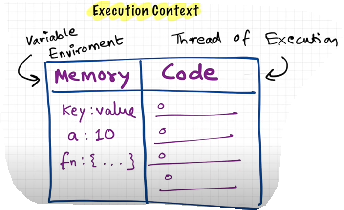

# How JavaScript Works & Execution Context

0. Questions

    - Do you know how javaScript works and how the code is executed ?

    - Is javaScript Synchronous or Asynchronous ?

    - Is JavaScript Single Threaded or Multi-Threaded ?

1. First Core Fundamental : (Execution Context)

    - Everything in JavaScript happens inside an "Execution Context".

    - You can assume this "excution context" to be a big box or a container in which whole javaScript code is executed.

    - Execution Context contains two parts:

        1. Memory Component
        2. Code Component
    
    - "Memory Component": This is the place where all the variables and functions are stored as a key value pairs.

    - "Variable Environment": This memory component is also called with a heavy word called "variable environment".

    - "Variable Environment": It's sort of an environment in which all the variables and functions are stored as the key value pairs.

    - "Code Component": This is the place where whole javaScript code is executed one line at a time

    - "Thread of Execution": There is also a heavy word for "Code Component", it is also known as "thread of execution".

    - "Thread of Execution": This thread of execution is just like a "thread" in which the whole code is executed one line at a time. 

2. Second Core Fundamental:

    - JavaScript is a "Synchronous Single-Threaded" language.

    - "Single Threaded": It means javaScript can only execute one command at a time and in a specific order.

    - It can only go to the next line, once the current line has been finished.
