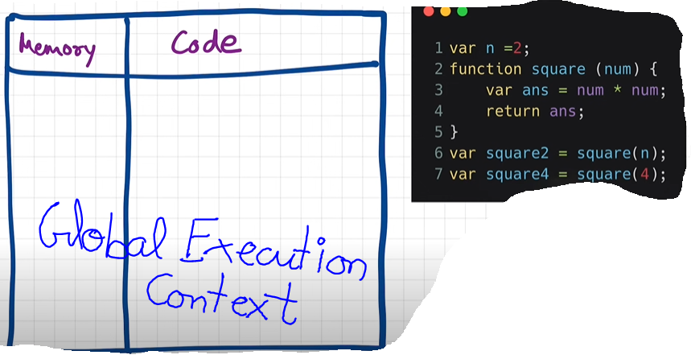
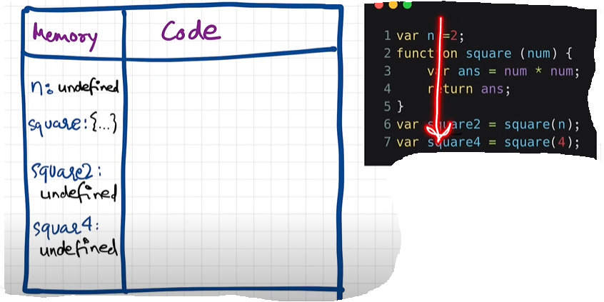
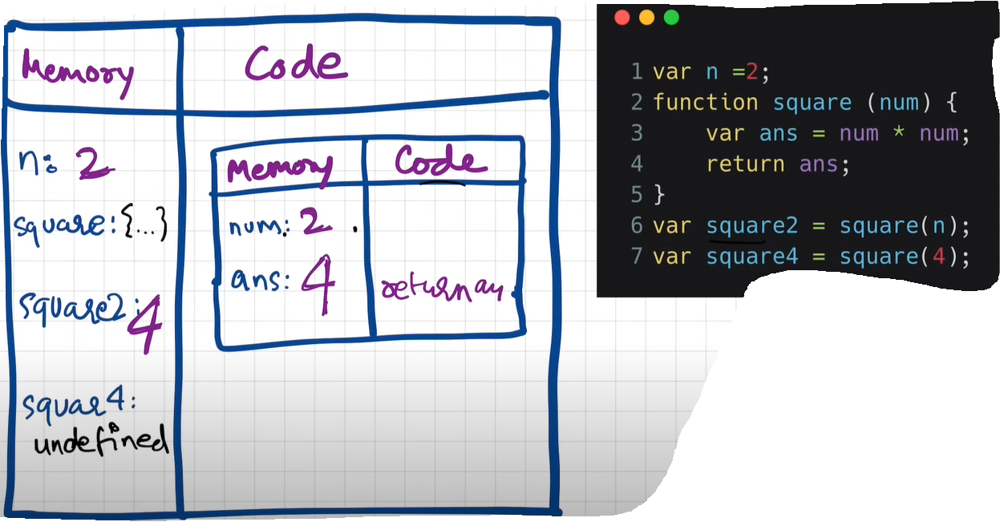
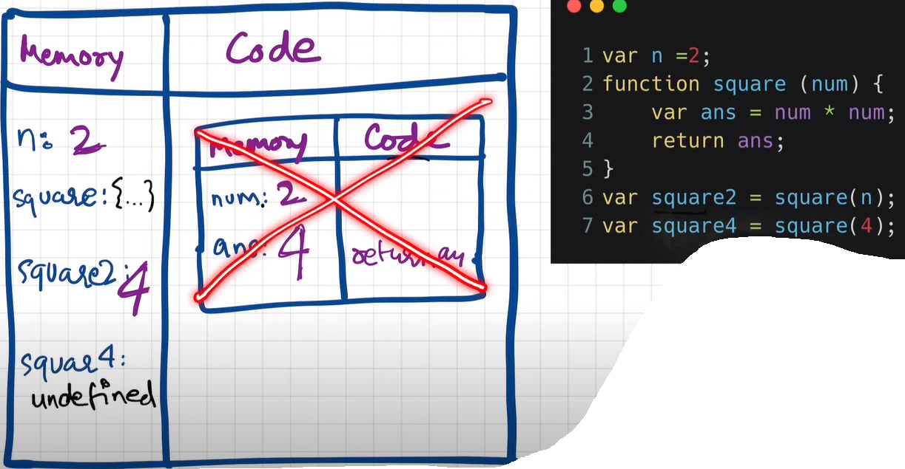
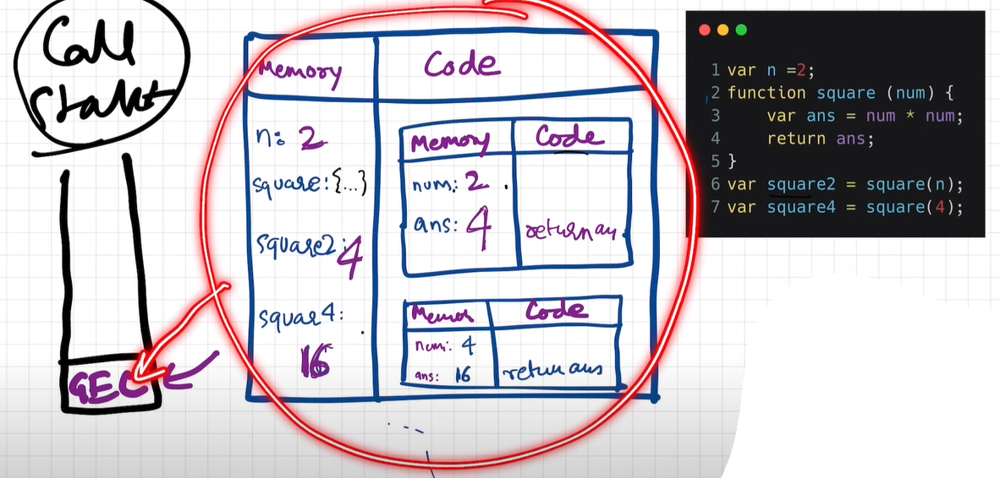
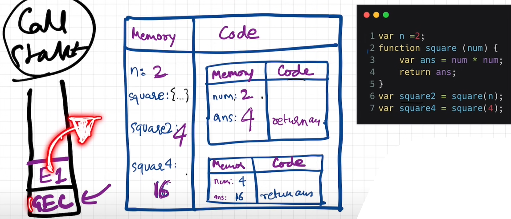

# How JavaScript Code is executed & Call Stack

0. Questions

    - What happens when you run Javascript code ?

1. What happens when you run a JavaScript code ?

    - When you run a JavaScript program an "execution context is created".

    - When you run the whole JavaScript code a "GLOBAL EXECUTION CONTEXT" is created.

    - It is also a big box having two components, the memory component and the code component.

    - This "EXECUTION CONTEXT" is created in two phases:

        1. Creation Phase or Memory Creation Phase
        2. Code Execution Phase
    
    - "Memory Creation Phase": In the first phase of memory creation, javaScript will allocate memory to all variables and functions.

    - Initially every allocated variable stores a special value called "undefined" inside the memory space.

    - Initially every allocated function, literally stores the whole code of the function inside the memory space.

    - "Code Execution Phase": JavaScript once again runs through the whole code line by line, and starts executing the code.

    - Till now the value of variable is undefined and now in the "Code Execution Phase" the actual value is placed at the placeholder/identifier of the variable inside the memory phase.

    - Like n is assigned value as 2.

    - Line 6 and 7 of the code are the "function invocation" calls, and when a function is invoked in JavaScript a all new "Execution Context" is created for that function.

    - The whole javaScript code was running in the "GLOBAL EXECUTION CONTEXT" and now when you run a function or invoke a function, a "BRAND NEW EXECUTION CONTEXT" is created for that function.

    - Now this "EXECUTION CONTEXT" of the function again has two components:

        1. Memory Component
        2. Code Component

    - And this "EXECUTION CONTEXT" of the function is again created in two phases:

        1. Creation Phase or Memory Creation Phase
        2. Code Execution Phase
    
    - "Parameters" of the function

    - "Arguments" of the function

    - "return" keyword in function: It states that "return" the control of the program back to the place where this function was invoked.

    - And now the "EXECUTION CONTEXT OF THIS FUNCTION" will be completely deleted.

2. Call Stack:

    - JavaScript handles everything to manage this "EXECUTION CONTEXT" creation, deletion, control using a stack called "CALL STACK".

    - This "CALL STACK" is stack where the "GLOBAL EXECUTION CONTEXT" is always present at the bottom.

    - Whenever the JavaScript code is run, the call stack is populated with the "GLOBAL EXECUTION CONTEXT".

    - And whenever a function is invoked or a "NEW EXECUTION CONTEXT" is created, then this "NEW EXECUTION CONTEXT" is "pushed" to the top of the "CALL STACK".

    - And when the code "return" from the function, the "EXECUTION CONTEXT" of this function is "POPPED" from the top of the "CALL STACK".

    - And after the whole javaScript code is exectued the "GLOBAL EXECUTION CONTEXT" is also "POPPED OUT" from the call stack, and the call stack becomes "EMPTY".

3. Call stack maintains the "ORDER OF EXECUTION" of execution contexts.

4. Other names of the Call Stack in JS

    - Execution Context Stack

    - Program Stack

    - Control Stack

    - Runtime Stack

    - Machine Stack