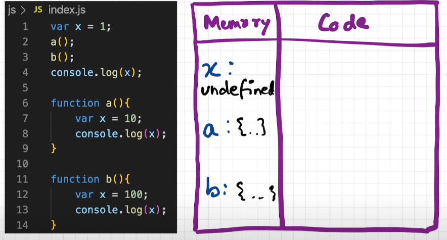
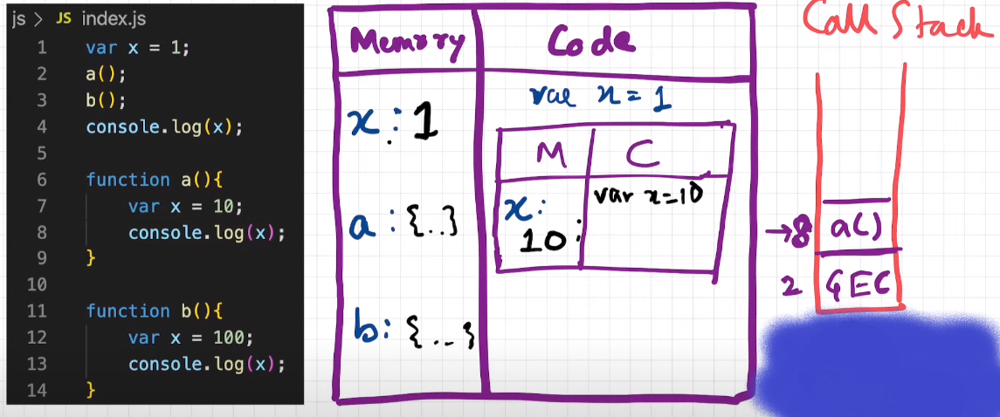
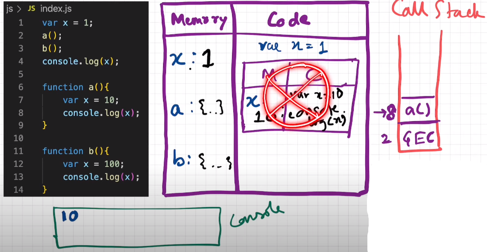
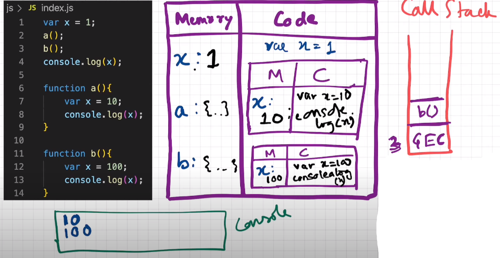

## How functions work in JS ❤️ & Variable Environment

### Function Invocation and Variable Environment in JS:

- ```javaScript 
        var x = 1;
        a();
        b();
        console.log(x);

        function a() {
            var x = 10;
            console.log(x);
        }

        function b() {
            var x = 100;
            console.log(x);
        }
  ```

- Deep dive Explanation of the code of function invocation:

    - First Phase of Memory Allocation:



    - Second Phase of Code Execution:

        - When the function is invoked a new execution context is created which is very much limited to the function itself.

        - The variable inside this execution context are independent of the other variable outside it's function execution context.

        - JavaScript will first look for the value of the variable in the local/function execution context.



        - Now when the code of the function is done executing, the execution context of the function is deleted.



        - Now the same process happens with the second function invocation.



        - Now when the code of the second function is done executing, the execution context of this function is also deleted.


        - Finally the control goes back to the global execution context, and now javaScript looks for the variable in the global execution context.

    


