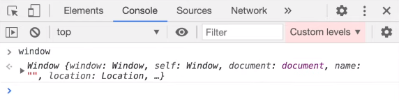
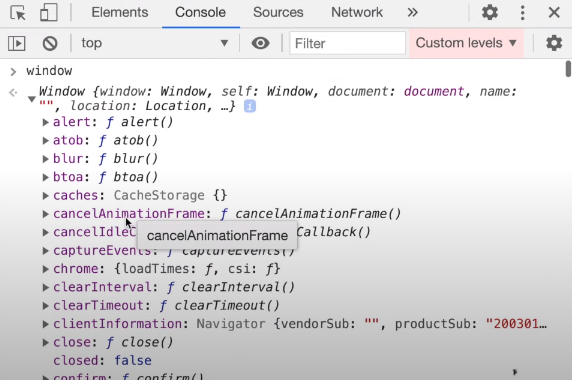
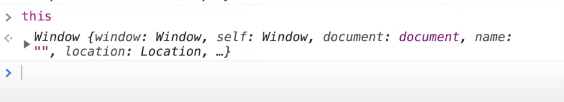
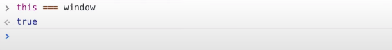

## SHORTEST JS Program 🔥window & this keyword

### Behind the Scenes of the shortest JavaScript Program:

- The empty index.js file is the shortest javaScript program.

- JavaScript creates a global execution context and sets up the memory space, though the index.js file is empty but JavaScript engine does a lot of work behind the scene.

### Window:

- JavaScript engine also does something interesting, it creates something known as ```window```.

- 

- What is this ```window```, we did not do create that?

- ```window``` is like a big object with a lot of functions and methods.

- 

- These function and methods are created by the ```JavaScript Engine```.

- This window object is created inside the ```global execution``` by the JavaScript Engine, and it's functions and methods are available anywhere inside the javaScript program.

- So window is actually a global object which is created along with the global execution context.

- Whenever we create any vatibles or functions in the global memory space, they get attached to the ```window global object```.

    - ```javaScript
            var a = 10;
            function b() {
                var x = 10;
            }

            console.log(window.a); // 10
            console.log(a); // 10
            console.log(this.a); // 10
            console.log(window.b); // ƒ b() { var x = 10; }
            console.log(window.x); // x is not defined
      ```

### this keyword:

- Just like window object, the javaScript engine also creates a ```this keyword```.

- 

- And at the global level this ```this keyword``` points to the window object.

- 


## So whenever any javaScript program is run a ```global object``` is created, a ```global exectution context``` is created, and along with that global execution context a ```this variable``` is created.


