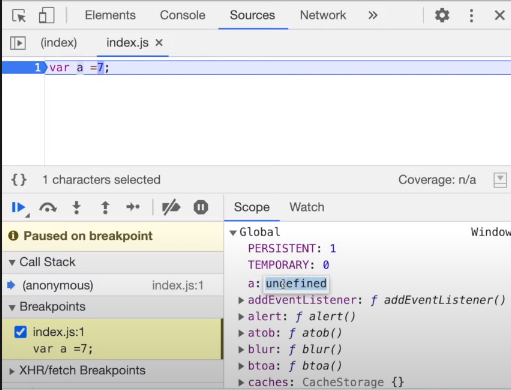

## undefined vs not defined in JS

### Summary:

- Undefined is like a placeholder till a variable is not assigned a value.

- undefined !== not defined

- JS- weakly typed language since it doesn't depend on data type declarations.

### undefined vs not defined:

- undefined is lika a placeholder till a varible is not assigned a value.

- 

- ```javaScript

        console.log(a); // undefined
        var a;
        console.log(a); // undefined

        if(a === undefined) {
            console.log("a is undefined");
        } else {
            console.log("a is not undefined");
        }

        a = 10;
        console.log(a); // 10

        if(a === undefined) {
            console.log("a is undefined");
        } else {
            console.log("a is not undefined");
        }

        console.log(x); // Uncaught ReferenceError: x is not defined
  ```

### JavaScript is a ```loosely typed language``` a.k.a ```weakly typed language```:

- Loosely typed means it does not attaches it's varialbes to any specific data type.

- ```javaScript

        var a;
        console.log(a); // undefined
        a = "Not Afraid";
        console.log(a); // Not Afraid
        a = true;
        console.log(a); // true
        a = 55;
        console.log(a); // 55
        a = 'Superman';
        console.log(a); // Superman

  ```

- ```Loosely typed language``` are also known as ```weekly typed language```.

### Mistake we should not make while using undefined:

- ```javaScript 
        var a = undefined; ☠ ☠ ☠ ☠ ☠ ❌❌❌❌❌❌
  ```

- Never assign undefined to a variable, it can lead to a lot of inconsistency.

- Instead we can assign null to the variable

- ```javaScript
        var a = null; 👌🏻👌🏻👌🏻👌🏻👌🏻👌🏻👌🏻👌🏻👌🏻👌🏻👌🏻
  ```

