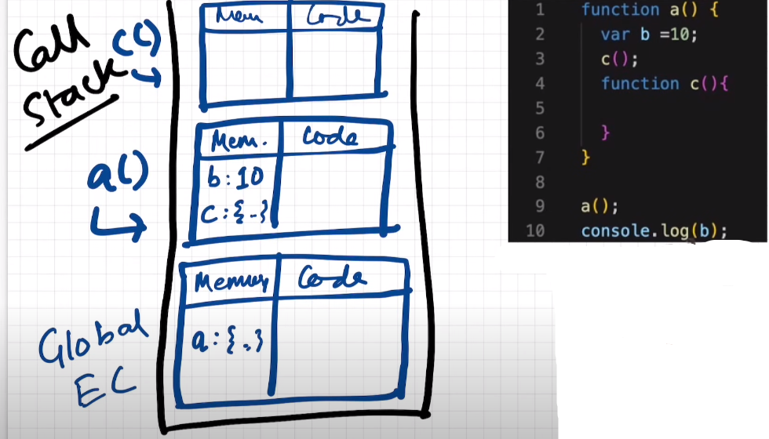
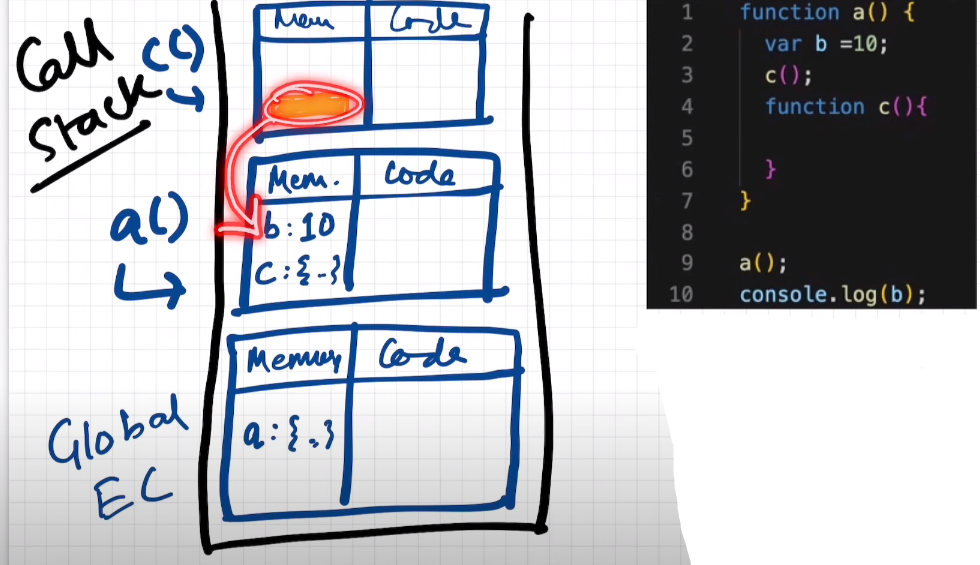
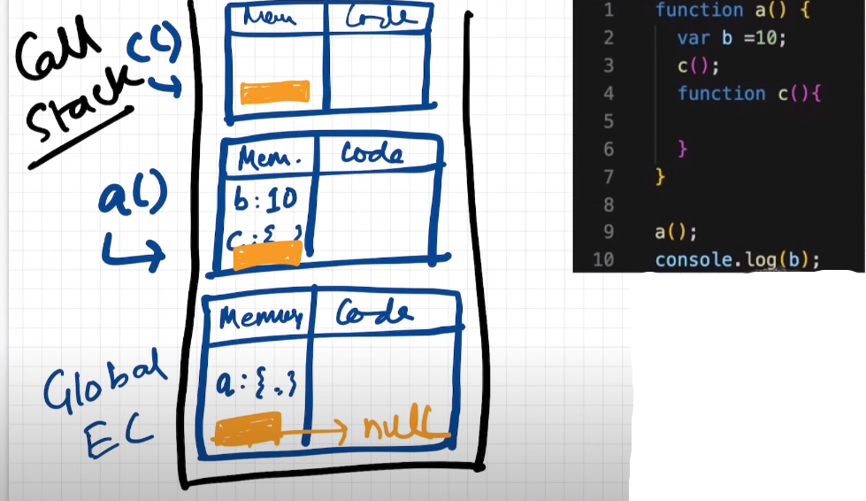
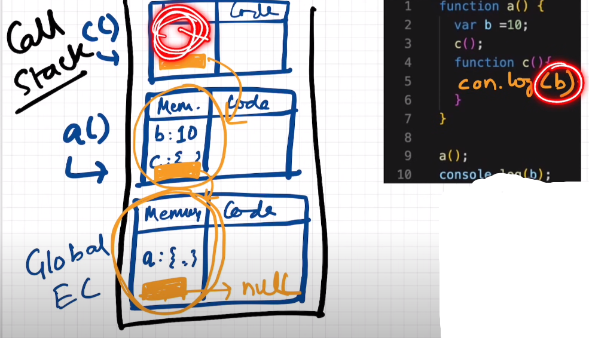

## The Scope Chain, 🔥Scope & Lexical Environment

### Watch the video again: 💥💥💥💥💥💥💥

### Summary:

- Lexical environment is created whenver an execution context is created.

- Lexical environment = Local Memory + reference to the lexical environment of it's parent(i.e. lexical parent).

- Lexical parent is where the code actually sits inside the program.

- This whole chain of lexical environment is known as the Scope Chain.

- This Scope Chain defines whether a variable or a function is present inside the scope or not.

### Introduction - Scope and the Lexical Environment:

- Scope in javaScript is directly related to lexical environment.

- ```javaScript

        function a() {
            console.log(b); // 10
        }

        var b = 10;
        a();
  ```
- Now when we do console.log(b), javaScript engine will first try to find the variable b in the local/function execution context and then if the variable is not present inside the local/function execution context, then the javaScript engine trys to find the variable b in the outer execution context which may another outer function or the global execution context.

- ```javaScript

        function a() {

            function c() {
                console.log(b); // 10
            }
            c();
        }

        var b = 10;
        a();
  ```
- Now when we do console.log(b), javaScript engine will first try to find the variable b in the local/function execution context and then if the variable is not present inside the local/function execution context, then the javaScript engine trys to find the variable b in the execution context of the outer function and then again if the variable b is not present in the outer function then the javaScript engine tries to find variable b in the global execution context.

- But the vice versa is not possible.

- ```javaScript

        function a() {

            console.log(e); // e is not defined
            function c() {
                var b = 10;
                var e = 100;
            }
            c();
        }

        console.log(b); // b is not defined
        a();
  ```

### Scope:

- Scope means where you can access a specific variable or a function in our javaScript program/code.

- What is the scope of a variable?

    - It means where can I access the specific variable.

- Is a variable inside the scope of a function?

    - It means that can I access this specific variable inside that function. 

- Scope is directly dependent on the Lexical Environment.

- 

### Lexical Environment:

- Wherever an execution context is created, a lexical environment is also created.

- So Lexical Environment is the local memory along with the lexical environment of it's parent.

- Lexical - It is a term which means In-hierarchy  or in a sequence.

- We can say that the function c() is sitting lexically inside the function a().

-                                  OR

- We can say that function a() is the lexical parent of function c().

- In code terms Lexical means that where that specific code is present physically inside the whole program.

- Similarly, function a() is sitting lexically inside the global scope.

-                                  OR

- We can say that global scope is the lexical parent of function a();

### Understaning Lexical Environment Visually:

- So whenever a execution context is created, it also gets a ```reference``` to the lexical environment of it's parent.

- So along with the variables and function in the memory space of the execution context, there is also a reference to the lexical environment of it's parent.

- 

- This orange box is like refernce to the lexical environment of the parent of function c() i.e. lexical environment of 
function a().

- Like wise function a() also has reference to the lexical environment of it's parent.

- 

- Note : ```The reference to the lexical environment of the global scope parent is null```.

- Note : ``` i.e. The lexical parent of the global scope is null```.

### Scope Chain:

- 

- This way or mechanism or finding the variables, like first the variable was searched in the local memory and was not there inside, then it goes to the reference of the outer parent and searches in the local memory of the outer parent, and if it was even not there, then it goes to the reference of it's parent and searches in the global scope.

- This ways or mechanism is what is known as the ```Scope Chain```.

- Going and Searching in the parent's local memory is also known as ```going to the next level of scope chain```. 

- This 