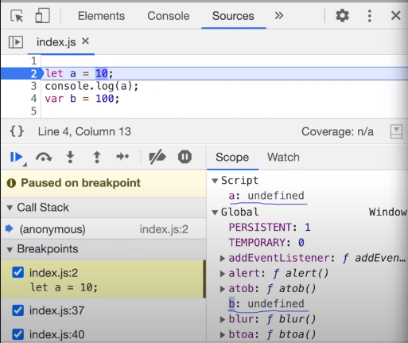
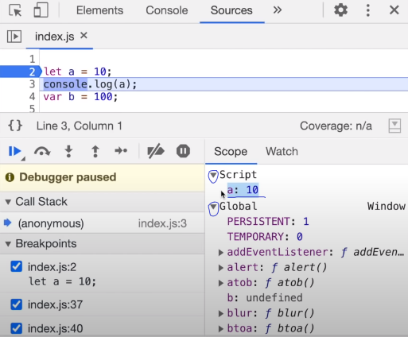

## let & const in JS 🔥Temporal Dead Zone

### Interview Question - Hoisting of let and const:

- Explain about temporal dead zone.

- And explain different hoisting behaviour in let and var.

### Questions:

- What is a ```Temporal Dead Zone```?

- Are ```let & const``` declarations ```hoisted```?

- ```Syntax```Error vs ```Reference```Error vs ```Type```Error?

### Yes, ```let & const``` decalaration are ```hoisted```:

- ```let & const``` declarations are hoisted, but they are hoisted very differently to the ```var``` declaration. 

- ```let & const``` are in the ```temporal dead zone``` for the time being.

### let declaration hoisting in JS:

- 

- In the initial memory allocation phase, We can see that var variables are allocated memory in the ```Global Object or Global Execution Context``` and the let variables are allocated memory in something called ```Script``` which is a completely different memory space than the ```global object```.

- So let variable was hoisted and was allocated a memory in a separate memory space called ```Script```.

- So we can see that let & const variables declaration are not on the ```Global Object``` rather they are stored in a separate memory space.

- And we cannot access this separate memory space before we have put in some values in the let and const declarations.

- This is how hoisting works in let declarations.

- 

- Now after the assignement, let varialbe declaration ```a``` is assigned a value 10, but still it is in a separate memory space and is not part of the ```Global Object or Global Memory```.

- But now after the assignment, the let variable declaration is available for access.

### Temporal Dead Zone in JavaScript:

- Temporal Dead Zone is the time since when this ```let``` variable was ```hoisted``` and till it is ```initialized some value```.

- The time between that is known as the ```Temporal Dead Zone```.

- Temporal Dead Zone Starts -> ```let``` variable was ```hoisted``` or ```declared```.

- Temporal Dead Zone Ends -->  ```let``` variable was ```initialized some value```.

- ```javaScript

        console.log(b); // undefined , variable b is accessible before initialization due to hoisting
        console.log(a); // ReferenceError: Cannot access 'a' before initialization, let declaration are hoisted but work very different than the var declaration

        let a = 10;
        console.log(a); // 10
        var b = 100;
  ```

- Now whenever we try to access a variable inside the temporal dead zone , it gives you a ```ReferenceError```.

- When the variables are in this temporal dead zone, we cannot access them.

- These variables can only be accessed once some value has been initialized to them.

### ReferenceError:

- ```javaScript

        console.log(x); // ReferenceError: x is not defined

        console.log(a); // ReferenceError: Cannot access 'a' before initialization, let declaration are hoisted but work very different than the var declaration

        let a = 10;
        console.log(a); // 10
  ```

### Relation of global object and variables var, let & const:

- ```javaScript

        let a = 10;
        console.log(a);
        var b = 100;

        console.log(window.b); // 100, "var" variables are attached to the global object
        console.log(this.b); // 100

        console.log(window.a); // undefined, "let" variables are not attached to the global object, but they are stored in a separate memory space.
        console.log(this.a);
  ```

### SyntaxError:

- ```javaScript

        var a = 100;
        var a = 200;
        console.log(a); // duplicate redeclaration is allowed in "var" variables

        let b = 300;
        let b = 400;

        console.log(b); // SyntaxError: Identifier 'b' has already been declared

  ```

### Important Difference between ```let``` and ```const```:

- ```javaScript

        let a;

        const b = 1000;
        console.log(b); // 1000

        a = 10;
        console.log(a); // 10

        b = 5000;
        console.log(b); // TypeError: Assignment to constant variable.

  ```

- ```javaScript

        let a;
        console.log(a);
        const b;
        console.log(b); // SyntaxError: Missing initializer in const declaration

  ```

### var v/s let v/s const:

- We should always use 'const' as much as possible.

- If a value can be updated, then we should use 'let'.

- Avoid using 'var' as much as possible.

### How to avoid Temporal Dead Zone:

- The best way to avoid the temporal dead zone is alway put our declarations and initialization on the top of the scope.

- So that as soon as our code starts running it hits the declarations and initializations at the first and then it goes to the logic.