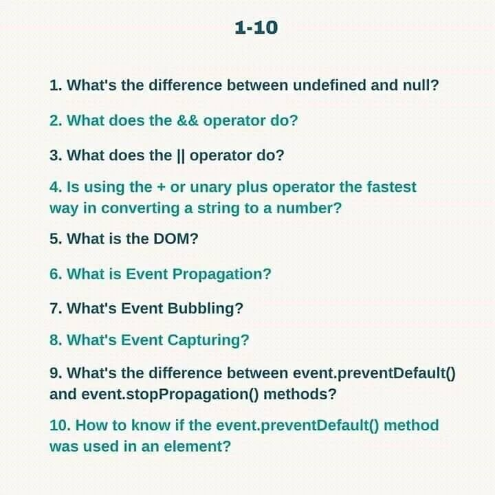
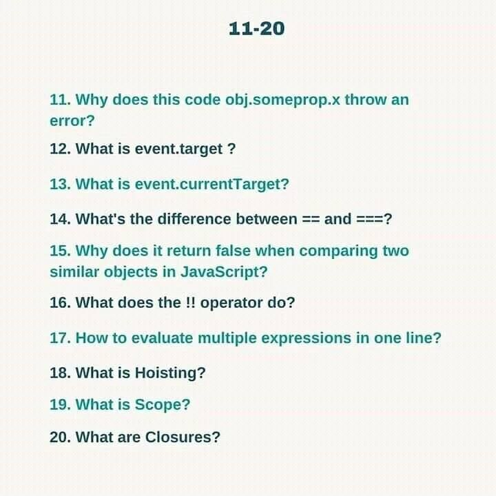
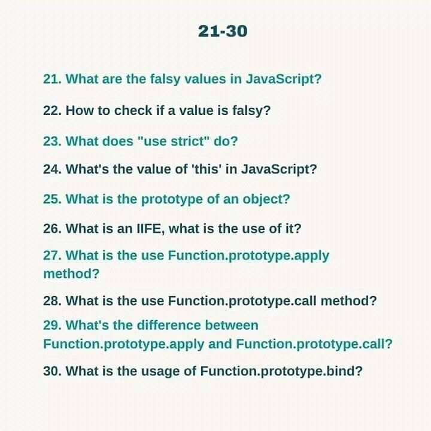
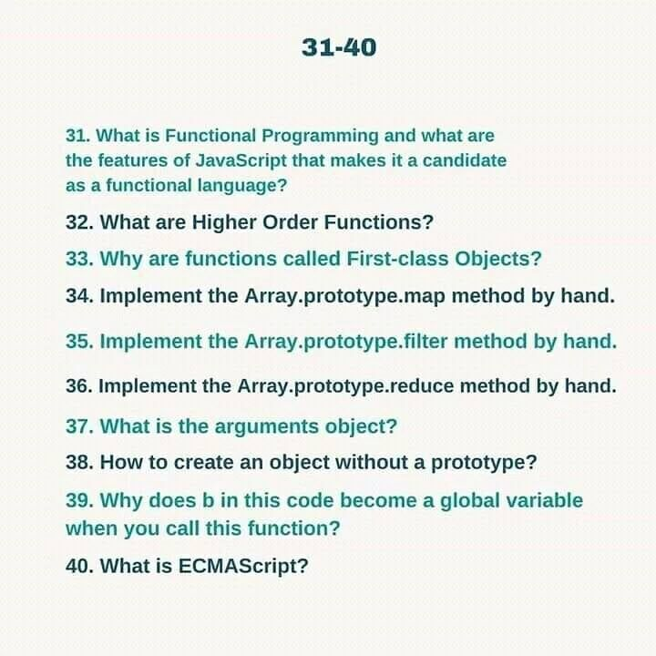
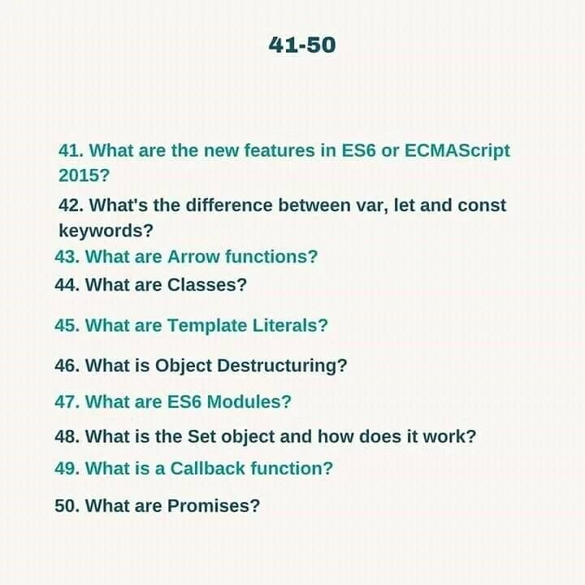
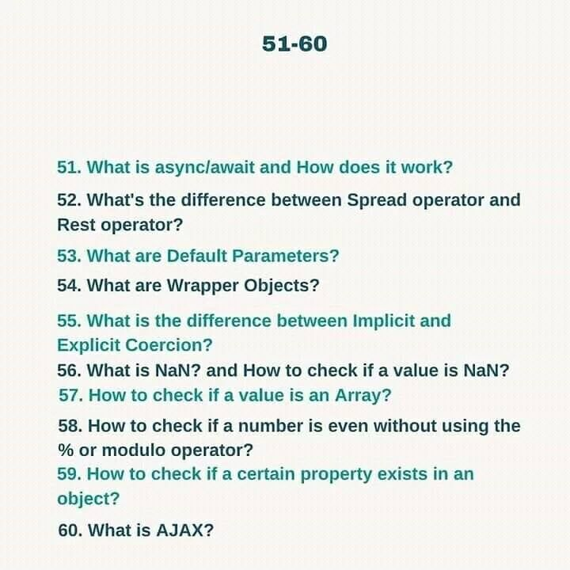

# JavaScript Interview Preparation:

0. Resource Links:

    1. Namaste JavaScript
    
    2. Pepcoding Nados

    3. https://github.com/devkodeio/javascript-interview-questions

    4. https://github.com/devkodeio/the-dom-challenge

    5. https://www.javascripttutorial.net/

    6. https://eloquentjavascript.net/

1. 70 JavaScript Interview Questions:

